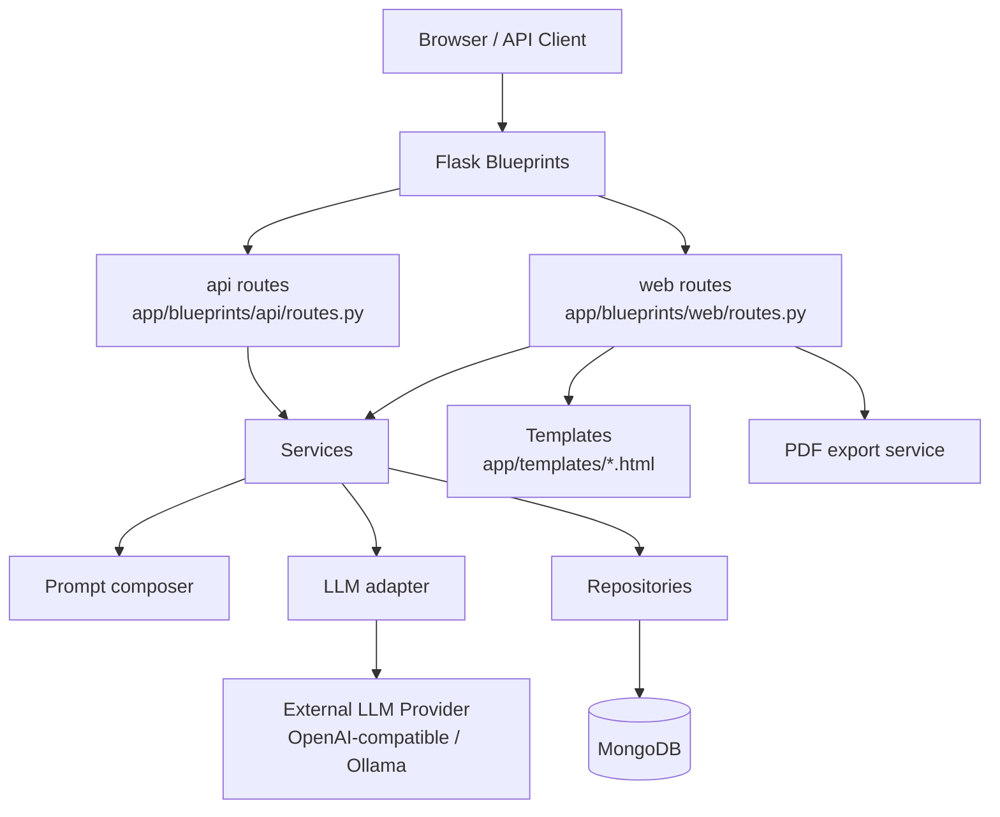
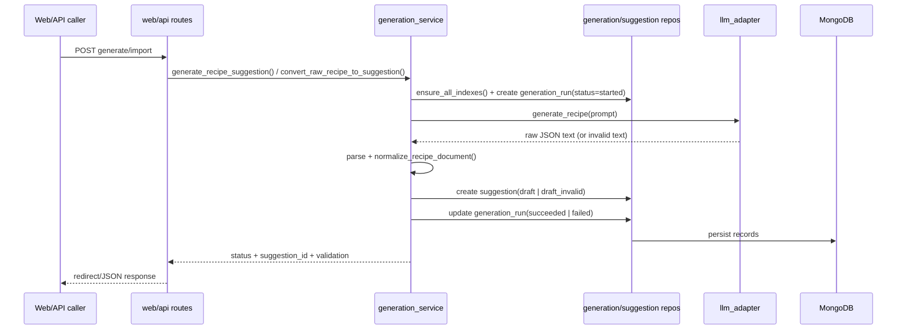
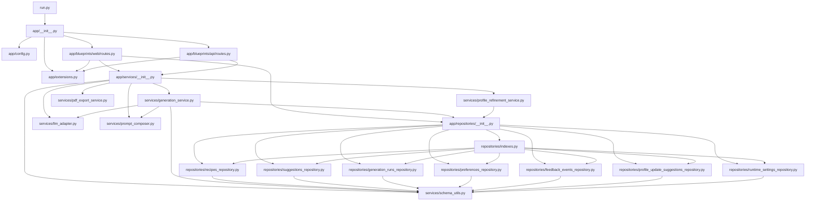

# RecipeLab Architecture Reference

## 1) System Overview

RecipeLab is a Flask + MongoDB application for managing a recipe library and generating/refining recipes with LLM support.

At a high level, it provides:

- **Web UI** for browsing, editing, importing, generating, and exporting recipes.
- **Responsive + accessible UI layer** (Bootstrap + custom dark theme) with mobile-first navigation/actions, keyboard skip-link support, and focus-visible styling.
- **API endpoints** for health checks and recipe generation.
- **Service layer** for LLM orchestration, prompt construction, schema normalization, PDF export, and profile refinement.
- **Repository layer** for MongoDB persistence and index management.
- **Recipe content library** under `recipes/` and an import script to ingest markdown recipes.
- **Tests** with in-memory fakes for route/service/repository behaviors.

Primary runtime dependencies: Flask, PyMongo, python-dotenv, OpenAI SDK, Gunicorn.

---

## 2) Architecture Flow

### 2.1 Runtime request flow (web + API)



### 2.2 Recipe generation/conversion pipeline



### 2.3 Recipe import from markdown

```mermaid
flowchart LR
    MD[recipes/**/*.md] --> Script[scripts/import_markdown_recipes.py]
    Script --> Parse[frontmatter + sections parser]
    Parse --> Normalize[RecipesRepository.upsert_by_source_path\n(normalize_recipe_document)]
    Normalize --> DB[(MongoDB recipes)]
```

---

## 3) File/Module Inventory

## Root / Runtime

| Path | Purpose | Key responsibilities | Main exports / entrypoints |
|---|---|---|---|
| `run.py` | App entrypoint | Create Flask app and run server | `app = create_app()`; `__main__` runner |
| `Dockerfile` | Container build | Install deps, expose `3009`, run Gunicorn | `CMD gunicorn --bind 0.0.0.0:3009 run:app` |
| `docker-compose.yml` | Local container orchestration | Build/run app with `.env` | `web` service on `3009` |
| `docker-compose-example.yml` | Production-like compose example | Pull GHCR image, healthcheck `/api/health`, network/logging setup | `recipelab` service |
| `.github/workflows/docker-release.yml` | Release automation | Build/push tagged Docker images | reusable workflow invocation |
| `.env.example` | Env template | Required app + optional LLM/runtime config values | N/A |
| `requirements.txt` / `requirements-dev.txt` | Dependency definitions | Runtime + lint/format deps | N/A |
| `pyproject.toml` / `.flake8` | Code quality config | Black and Flake8 settings | N/A |

## Application package (`app/`)

| Path | Purpose | Key responsibilities | Main exports / entrypoints |
|---|---|---|---|
| `app/__init__.py` | App factory | Load config, validate required env, init extensions, register blueprints | `create_app()` |
| `app/config.py` | Runtime configuration | Load `.env`, map env vars to dataclass, validate required keys | `AppConfig` |
| `app/extensions.py` | Infra wiring | Create MongoClient/DB handles and health probe | `init_extensions()`, `get_mongo_db()`, `mongo_health()` |
| `app/blueprints/web/routes.py` | Web UI endpoints | Dashboard, recipes, suggestions, generate/import, profile, settings, PDF, feedback flows | `web_bp` + route handlers |
| `app/blueprints/api/routes.py` | API endpoints | Health and recipe generation JSON API | `api_bp`, `/health`, `/generate` |
| `app/blueprints/*/__init__.py` | Package markers | Namespace structure | none |

## Service layer (`app/services/`)

| Path | Purpose | Key responsibilities | Main exports / entrypoints |
|---|---|---|---|
| `app/services/__init__.py` | Service facade | Re-export service constants/functions for route imports | `MEAL_TYPES`, generation/profile/PDF/schema APIs |
| `app/services/generation_service.py` | LLM workflow orchestration | Build prompts, call adapter, persist generation runs + suggestions, resolve model selection | `generate_recipe_suggestion()`, `convert_raw_recipe_to_suggestion()`, `get_allowed_models()`, `get_effective_model()` |
| `app/services/llm_adapter.py` | LLM transport abstraction | OpenAI-compatible/Ollama request handling and response parsing | `LLMAdapter`, `LLMAdapterError` |
| `app/services/prompt_composer.py` | Prompt construction | Build generation and canonical conversion prompts with constraints/profile context | `compose_recipe_prompt()`, `compose_canonical_conversion_prompt()`, `DEFAULT_HARD_CONSTRAINTS` |
| `app/services/schema_utils.py` | Domain validation/normalization | Canonicalize recipe/suggestion/preferences/feedback/generation-run docs and enums | `normalize_*` functions, `MEAL_TYPES`, etc. |
| `app/services/pdf_export_service.py` | PDF export | Build simple one-page PDF bytes and safe filename from recipe data | `render_recipe_pdf()`, `pdf_filename_for_recipe()` |
| `app/services/profile_refinement_service.py` | Profile learning | Mine feedback tokens, create profile update suggestions, apply/reject updates | `generate_profile_update_suggestions()`, `apply_profile_update_suggestion()`, `reject_profile_update_suggestion()` |

## Repository layer (`app/repositories/`)

| Path | Purpose | Key responsibilities | Main exports / entrypoints |
|---|---|---|---|
| `app/repositories/__init__.py` | Repository facade | Re-export repository classes + index helper | `*Repository`, `ensure_all_indexes()` |
| `app/repositories/indexes.py` | Index bootstrap | Ensure all collection indexes exist | `ensure_all_indexes(db)` |
| `app/repositories/common.py` | Shared helpers | ObjectId coercion utility | `to_object_id()` |
| `app/repositories/recipes_repository.py` | `recipes` collection access | CRUD/list/soft-delete/upsert by source path; enforce recipe schema | `RecipesRepository` |
| `app/repositories/suggestions_repository.py` | `suggestions` collection access | Create/read/list by status/update status/update recipe for review | `SuggestionsRepository` |
| `app/repositories/generation_runs_repository.py` | `generation_runs` collection access | Track run lifecycle and raw output/errors | `GenerationRunsRepository` |
| `app/repositories/preferences_repository.py` | `preferences` collection access | Active profile upsert + active profile retrieval | `PreferencesRepository` |
| `app/repositories/feedback_events_repository.py` | `feedback_events` collection access | Store/list feedback per recipe/suggestion | `FeedbackEventsRepository` |
| `app/repositories/profile_update_suggestions_repository.py` | `profile_update_suggestions` collection access | Create/list/update suggested profile changes | `ProfileUpdateSuggestionsRepository` |
| `app/repositories/runtime_settings_repository.py` | `runtime_settings` collection access | Persist selected generation model | `RuntimeSettingsRepository` |

## UI / content / scripts / tests

| Path | Purpose | Key responsibilities | Main exports / entrypoints |
|---|---|---|---|
| `app/templates/*.html` | Server-rendered UI | Dashboard, generation/import forms, recipe/suggestion detail/edit, settings/profile, responsive page-header/action-row patterns | Jinja templates used by web routes |
| `app/static/` | Static assets | Theme CSS (responsive helpers, dark theme, focus styles, mobile touch sizing) + favicon/webmanifest/browserconfig assets | N/A |
| `recipes/` | Recipe markdown corpus | User and AI-suggested source recipes | N/A |
| `prompts/*.md` | Prompt references | Canonical formatting and suggestion prompt guidance | N/A |
| `scripts/import_markdown_recipes.py` | CLI import utility | Parse markdown recipes, infer meal/source type, upsert to MongoDB | `main()` CLI |
| `tests/*.py` | Automated tests | Coverage for schema utils, repos/indexes, services, API/web routes, runtime settings | `unittest` test cases |
| `tests/fakes.py` | Test doubles | In-memory fake DB/collections/cursor/update behavior | `FakeDatabase`, `FakeCollection`, etc. |
| `docs/` | Project docs | Runbooks, checklists, logs, agent instructions | N/A |

---

## 4) Dependency Map

### 4.1 Module-level map (core app)



### 4.2 Core dependencies

- **Flask app composition:** `run.py` → `app.create_app()`.
- **Route layer:** web/API blueprints depend on services + repositories + extension DB access.
- **Persistence:** repository classes depend on PyMongo + schema normalization helpers.
- **LLM path:** `generation_service` depends on prompt composer + adapter + repositories.

### 4.3 Entry points

- **HTTP runtime:** `run.py` (also Gunicorn target `run:app`).
- **Web endpoints:** `app/blueprints/web/routes.py`.
- **API endpoints:** `app/blueprints/api/routes.py` (`GET /api/health`, `POST /api/generate`).
- **CLI import:** `scripts/import_markdown_recipes.py`.

### 4.4 Circular dependencies

- **No hard runtime circular import loops identified** among current modules.
- There is **cross-layer coupling**: repositories import `services/schema_utils.py`, while some services import repositories. This is valid today because `schema_utils` is utility-only and does not import repositories/services back.

---

## 5) Data Flow

### 5.1 Generation flow

1. User submits meal type/instructions via `/generate` or `POST /api/generate`.
2. Route validates meal type and calls `generate_recipe_suggestion()`.
3. Service ensures DB indexes, loads active profile + effective model.
4. Prompt composed from meal type + profile + user instructions.
5. Generation run persisted as `started` in `generation_runs`.
6. `LLMAdapter` calls configured provider and returns raw text.
7. Raw text parsed as JSON; recipe normalized via `normalize_recipe_document()`.
8. Suggestion persisted as `draft` (valid) or `draft_invalid`.
9. Generation run updated to `succeeded` or `failed`.
10. Route returns JSON (API) or redirects to suggestion review page (web).

### 5.2 Import conversion flow

1. User pastes raw recipe into `/import`.
2. `convert_raw_recipe_to_suggestion()` composes canonical-conversion prompt.
3. Same run/suggestion persistence lifecycle as generation.
4. User reviews/edit suggestion and can accept into recipes collection.

### 5.3 Suggestion acceptance flow

1. User posts `/suggestions/<id>/accept`.
2. Suggestion retrieved and validated as `draft`.
3. Suggestion recipe payload mapped into recipe document.
4. Recipe created in `recipes`; suggestion status set to `accepted`.
5. User redirected to recipe detail page.

### 5.4 Feedback → profile refinement flow

1. Feedback saved in `feedback_events` for `recipe` or `suggestion` targets.
2. `/profile` refresh action calls `generate_profile_update_suggestions()`.
3. Service resolves targets, tokenizes tags/ingredients, counts liked/disliked tokens.
4. Pending profile update suggestions stored in `profile_update_suggestions`.
5. Apply/reject routes update active `preferences` and suggestion statuses.

---

## 6) Key Interactions (common feature flows)

- **Dashboard counts**
  - `web.index()` → `RecipesRepository.list()` + `SuggestionsRepository.list_by_status()`.

- **Recipe generation**
  - `web.generate_page()` / `api.generate_recipe()` → `generation_service.generate_recipe_suggestion()` → `GenerationRunsRepository` + `SuggestionsRepository` + `LLMAdapter`.

- **Raw markdown-style import conversion**
  - `web.import_recipe_page()` → `generation_service.convert_raw_recipe_to_suggestion()`.

- **Suggestion review/edit/accept/reject**
  - `web.edit_suggestion()` → `normalize_recipe_document()` + `SuggestionsRepository.update_recipe_for_review()`.
  - `web.accept_suggestion()` → `RecipesRepository.create()` + `SuggestionsRepository.update_status()`.
  - `web.reject_suggestion()` → `SuggestionsRepository.update_status()`.

- **Recipe maintenance**
  - `web.edit_recipe()` → `RecipesRepository.update()` (uses `normalize_recipe_update()`).
  - `web.delete_recipe()` → `RecipesRepository.soft_delete()`.
  - `web.export_recipe_pdf()` → `render_recipe_pdf()`.

- **Runtime model settings**
  - `web.settings_page()` ↔ `RuntimeSettingsRepository`; generation uses `get_effective_model()`.

- **Profile refinement**
  - `web.profile_page(action=refresh_suggestions)` → `generate_profile_update_suggestions()`.
  - Apply/reject routes call `apply_profile_update_suggestion()` / `reject_profile_update_suggestion()`.

---

## 7) Extension Points

### 7.1 Add new API/web features

- Add route handlers in:
  - `app/blueprints/web/routes.py` (HTML/UI)
  - `app/blueprints/api/routes.py` (JSON API)
- Add template(s) in `app/templates/` for new web pages.

### 7.2 Add new domain behaviors/business logic

- Place orchestration in `app/services/`.
- Re-export in `app/services/__init__.py` for consistent route imports.

### 7.3 Add new persistence entities/collections

- Create repository in `app/repositories/`.
- Register index setup in `app/repositories/indexes.py` + export in `app/repositories/__init__.py`.
- Add document normalization helpers to `app/services/schema_utils.py`.

### 7.4 Add new LLM providers or model-routing rules

- Extend provider handling in `app/services/llm_adapter.py` (`generate_recipe()` switch).
- If provider-specific settings are needed, extend `AppConfig` and `.env.example`.

### 7.5 Extend profile learning

- Update token extraction/ranking logic in `app/services/profile_refinement_service.py`.
- Optionally add richer feedback fields via `normalize_feedback_event_document()` and feedback repository.

### 7.6 Extend import pipeline

- Improve markdown parser/inference in `scripts/import_markdown_recipes.py`.
- Keep canonical schema compatibility through `RecipesRepository.upsert_by_source_path()`.

### 7.7 Add observability or operational controls

- Health and startup checks currently in `app/extensions.py` and `app/config.py`.
- CI/CD release flow defined in `.github/workflows/docker-release.yml`.

---

## Notes on current architecture boundaries

- Architecture is intentionally lightweight: route handlers perform some orchestration directly, with heavy logic delegated to services/repositories.
- Normalization/validation is centralized in `schema_utils`, making it the main integrity gate before persistence.
- MongoDB collection index creation is centralized through `ensure_all_indexes()` and called from generation/import workflows.
